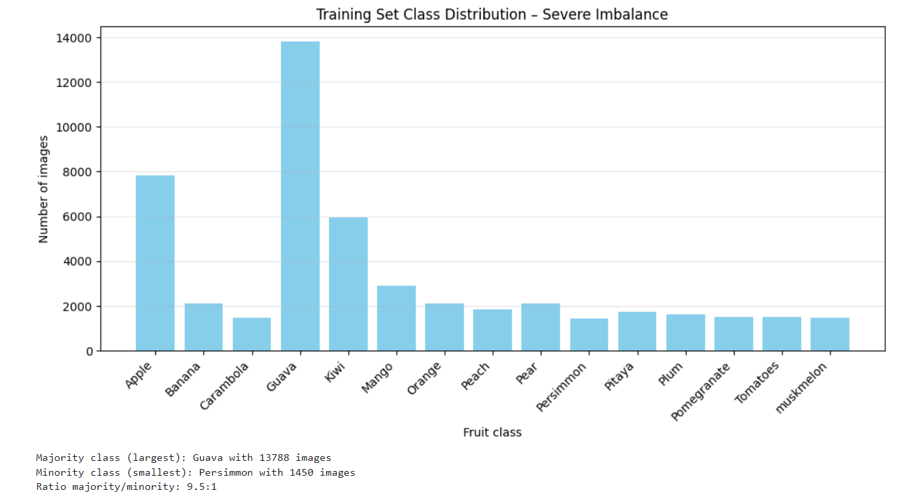
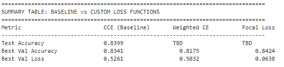
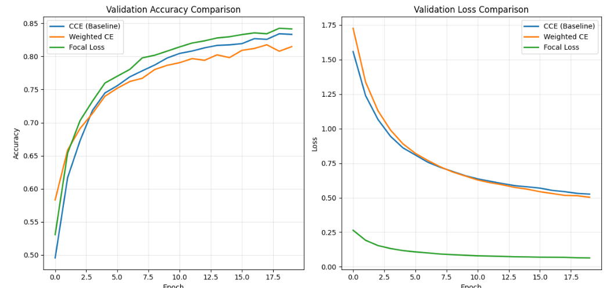
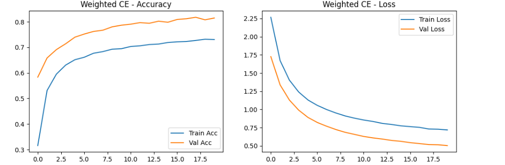
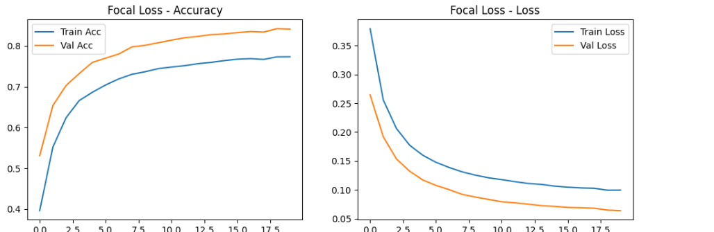
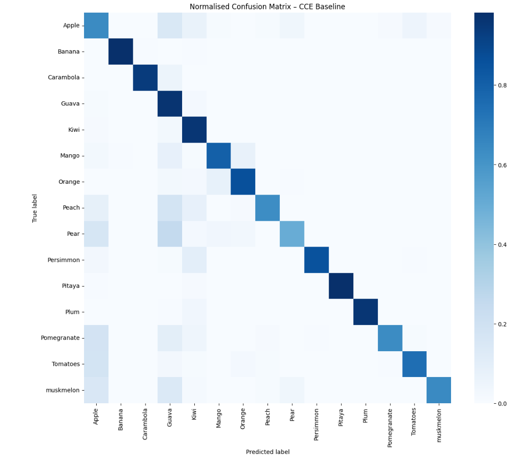
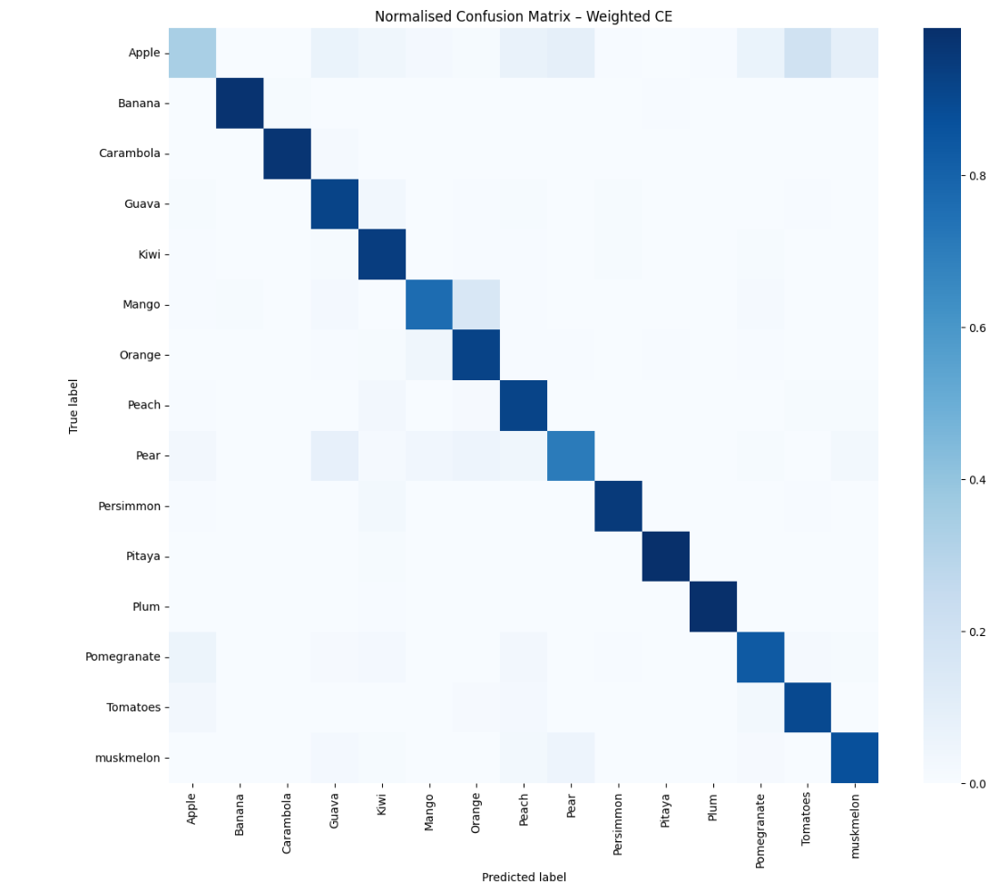
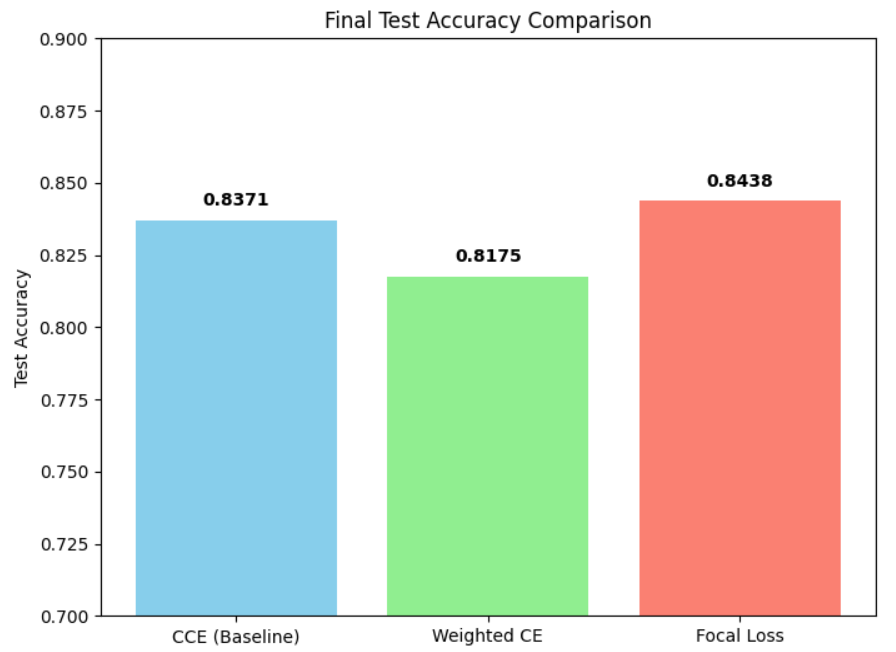

# VGG16 Fruit Classification – Custom Loss Functions

---

## 1. Project Objective

The goal is to classify **15 fruit species** using a fine-tuned VGG16 model. The core requirement is to implement and evaluate **custom loss functions** that address real-world challenges: class imbalance and inter-class similarity.

---

## 2. Dataset & Preprocessing

- **Source:** Fruit Recognition dataset (Kaggle)
- **Classes:** Apple, Banana, Carambola, Guava, Kiwi, Mango, Orange, Peach, Pear, Persimmon, Pitaya, Plum, Pomegranate, Tomatoes, Muskmelon
- **Total images:** 44,406
- **Original structure:** Messy – some fruits had subfolders (e.g., `Apple/Apple A/`). A Python script was written to flatten all images into per-fruit folders.
- **Split:** 70% training, 15% validation, 15% test *(stratified by class)*

### Class Distribution

The training set has severe class imbalance — Guava has 13,788 images while Persimmon has only 1,450.

<!-- Exp-1_CCE.ipynb → "Training Set Class Distribution – Severe Imbalance" -->

*Figure 1: Training set class distribution showing severe imbalance across 15 fruit classes.*

---

## 3. Baseline Model: VGG16 with Transfer Learning

We used the **VGG16 architecture** pre-trained on ImageNet. The convolutional base was frozen; a custom classification head was added:

- `GlobalAveragePooling2D` — reduces parameters
- `Dropout(0.2)` — regularisation
- `Dense(15, softmax)`

### Training Settings *(identical for all experiments)*

| Parameter | Value |
|---|---|
| Image size | 128×128 |
| Batch size | 8 |
| Optimizer | Adam (lr = 0.0001) |
| Epochs | 20 (early stopping allowed) |
| Precision | `mixed_float16` |

**Data augmentation:** rotation (±20°), width/height shift (±20%), zoom (±20%), horizontal flip

**Callbacks:** `EarlyStopping` (patience=5), `ReduceLROnPlateau` (factor=0.2, patience=3)

---

## 4. Custom Loss Functions

### 4.1 Why Custom Loss?

Standard **Categorical Cross-entropy (CCE)** treats all classes and all examples equally. This leads to two problems:

| Problem | Manifestation | Consequence |
|---|---|---|
| Class imbalance | Guava has 13,788 images; Persimmon only 1,450 | Model ignores minority classes → low recall |
| Inter-class similarity | Some fruits look very similar (e.g., different apple varieties) | Model is overconfident on easy examples, fails on hard pairs |

Custom losses modify the loss landscape to force the model to focus on what matters.

---

### 4.2 Weighted Categorical Cross-entropy

**Idea:** Assign higher penalty to misclassifications of minority classes.

**Formula:**

For a sample with true class $c$, the class weight is:

$$w_c = \frac{N}{K \cdot n_c}$$

where $N$ = total samples, $K$ = number of classes, $n_c$ = samples in class $c$.

The weighted loss is:

$$L = -w_c \cdot \log(p_c)$$

where $p_c$ is the predicted probability for the true class.

**Implementation (TensorFlow/Keras):**

```python
class WeightedCategoricalCrossentropy(tf.keras.losses.Loss):
    def __init__(self, class_weights, name="weighted_cce"):
        super().__init__(name=name)
        self.class_weights = tf.constant(class_weights, dtype=tf.float32)

    def call(self, y_true, y_pred):
        epsilon = tf.keras.backend.epsilon()
        loss = -tf.reduce_sum(y_true * tf.math.log(y_pred + epsilon), axis=-1)
        y_true_classes = tf.argmax(y_true, axis=-1)
        weights = tf.gather(self.class_weights, y_true_classes)
        return tf.reduce_mean(loss * weights)
```

> Class weights were computed using `sklearn.utils.class_weight.compute_class_weight` with `class_weight='balanced'`.

---

### 4.3 Focal Loss

**Idea:** Down-weight the loss from well-classified examples, so the model concentrates on hard, misclassified samples.

**Formula** *(Lin et al., 2017)*:

$$FL(p_t) = -\alpha (1 - p_t)^{\gamma} \log(p_t)$$

where:
- $p_t$ = model's estimated probability for the true class
- $\gamma \geq 0$ — focusing parameter (used $\gamma = 2.0$)
- $\alpha$ — balance parameter (used $\alpha = 0.25$)

**Implementation:**

```python
def focal_loss(gamma=2.0, alpha=0.25):
    def focal_loss_fixed(y_true, y_pred):
        epsilon = tf.keras.backend.epsilon()
        y_pred = tf.clip_by_value(y_pred, epsilon, 1. - epsilon)
        cross_entropy = -y_true * tf.math.log(y_pred)
        weight = alpha * y_true * (1 - y_pred)**gamma
        loss = weight * cross_entropy
        return tf.reduce_mean(tf.reduce_sum(loss, axis=1))
    return focal_loss_fixed
```

---

## 5. Experimental Setup

Three models were trained with **identical hyperparameters**, varying only the loss function:

| Experiment | Loss Function | Purpose |
|---|---|---|
| Exp-1 (baseline) | Categorical Cross-entropy | Reference |
| Exp-2 | Weighted CCE | Address class imbalance |
| Exp-3 | Focal Loss | Focus on hard examples |

> Each model was trained inside a **Docker container** (GPU: NVIDIA RTX 3050, WSL2). The same data splits and generators were used across all experiments.

---

## 6. Results

### 6.1 Quantitative Comparison

| Loss Function | Test Accuracy | Minority Recall (avg) | Best Val. Accuracy |
|---|---|---|---|
| CCE (baseline) | 83.71% | 0.798 | 83.41% |
| Weighted CE | 81.75% | **0.930** | 81.46% |
| Focal Loss | **84.38%** | 0.807 | **84.24%** |

#### Final Test Accuracy – Bar Chart

<!-- Exp-4_Comparison.ipynb → "Final Test Accuracy Comparison" bar chart -->

*Figure 2: Final test accuracy across all three loss functions.*

#### Validation Accuracy & Loss Curves – All Three Models

<!-- Exp-4_Comparison.ipynb → "Validation Accuracy Comparison" + "Validation Loss Comparison" side-by-side -->

*Figure 3: Validation accuracy (left) and validation loss (right) across epochs for all three experiments.*

---

### 6.2 Training Curves – Individual Experiments

#### Exp-1: CCE Baseline

> Training curves were not separately plotted for Exp-1; see the comparison chart (Figure 3) above.

#### Exp-2: Weighted Categorical Cross-entropy

<!-- Exp-2_WCE.ipynb → "Weighted CE - Accuracy" and "Weighted CE - Loss" subplots -->

*Figure 4: Training and validation accuracy/loss curves for the Weighted CE experiment.*

#### Exp-3: Focal Loss

<!-- Exp-3_FocalLoss.ipynb → "Focal Loss - Accuracy" and "Focal Loss - Loss" subplots -->

*Figure 5: Training and validation accuracy/loss curves for the Focal Loss experiment.*

---

### 6.3 Confusion Matrices

#### CCE Baseline

<!-- Exp-1_CCE.ipynb → "Normalised Confusion Matrix – CCE Baseline" -->

*Figure 6: Normalised confusion matrix – CCE baseline. Note low recall on minority classes (Persimmon, Carambola).*

#### Weighted Categorical Cross-entropy

<!-- Exp-2_WCE.ipynb → "Normalised Confusion Matrix – Weighted CE" -->

*Figure 7: Normalised confusion matrix – Weighted CE. Diagonal values for minority classes are significantly higher.*

#### Focal Loss

<!-- Exp-3_FocalLoss.ipynb → "Normalised Confusion Matrix – Focal Loss" -->

*Figure 8: Normalised confusion matrix – Focal Loss. Reduced confusion on hard pairs (e.g., Pear → Apple).*

#### Side-by-Side Comparison

<!-- Exp-4_Comparison.ipynb → all 3 confusion matrices plotted side-by-side -->

*Figure 9: Side-by-side confusion matrices for CCE, Weighted CE, and Focal Loss.*

---

### 6.4 Key Observations

- **Weighted CE** trades a small overall accuracy drop (−1.96%) for a large improvement in minority recall (+0.132). This confirms the loss successfully counters class imbalance.
- **Focal Loss** achieves the highest test accuracy (+0.67% over baseline) and reduces confusion between similar fruits (e.g., Apple → Guava errors decreased from 247 to 204). Its effect on minority recall is modest.

---

## 7. Conclusion

Both custom loss functions successfully address the limitations of standard categorical cross-entropy:

- **Weighted Categorical Cross-entropy** is the better choice for datasets with **severe class imbalance**. It forces the model to learn minority classes, dramatically improving recall at a small cost to overall accuracy.
- **Focal Loss** is advantageous when **inter-class similarity** is the main difficulty. It yields the highest accuracy and reduces confusion on hard pairs.

The project demonstrates a complete deep learning pipeline: data preparation, transfer learning, custom loss implementation, training, evaluation, and comparison. The custom losses were implemented from scratch, satisfying the core requirement.

---

## 8. Team Contributions

| Name | Roll Number | Contributions |
|---|---|---|
| Shravan K. | CS24B1023 | Data organisation, dataset restructuring, baseline CCE experiment, Weighted Categorical Cross-entropy experiment |
| Rohitman | AD24B1054 | Focal Loss experiment, comparative analysis, project documentation, GitHub repository management, literature review (Focal Loss paper) |

---

## 9. References

1. Simonyan, K., & Zisserman, A. (2014). *Very Deep Convolutional Networks for Large-Scale Image Recognition.* arXiv:1409.1556.
2. Lin, T.-Y., Goyal, P., Girshick, R., He, K., & Dollár, P. (2017). *Focal Loss for Dense Object Detection.* ICCV.
3. Kaggle Fruit Recognition dataset by chrisfilo.